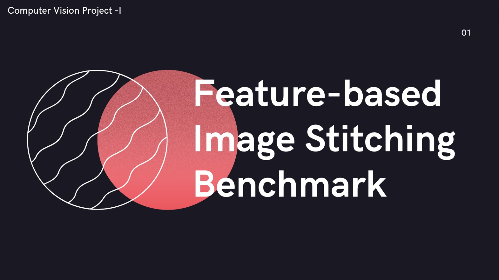
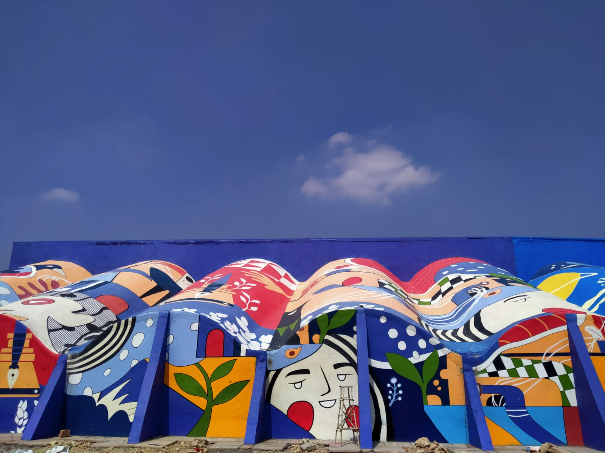
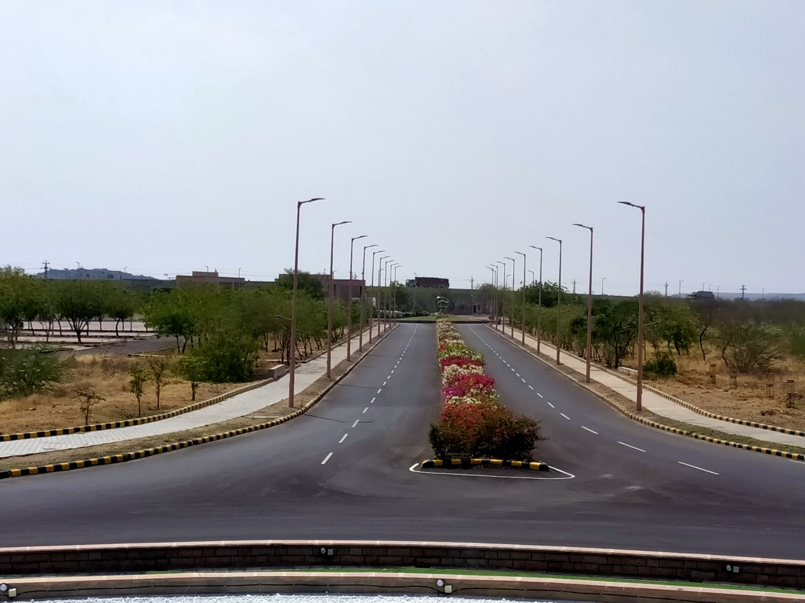
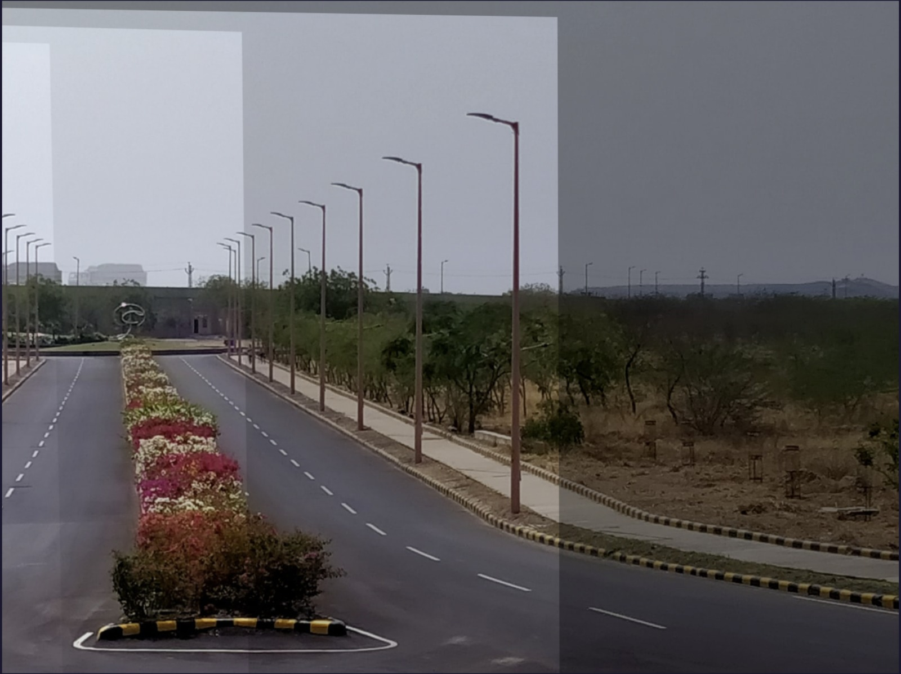
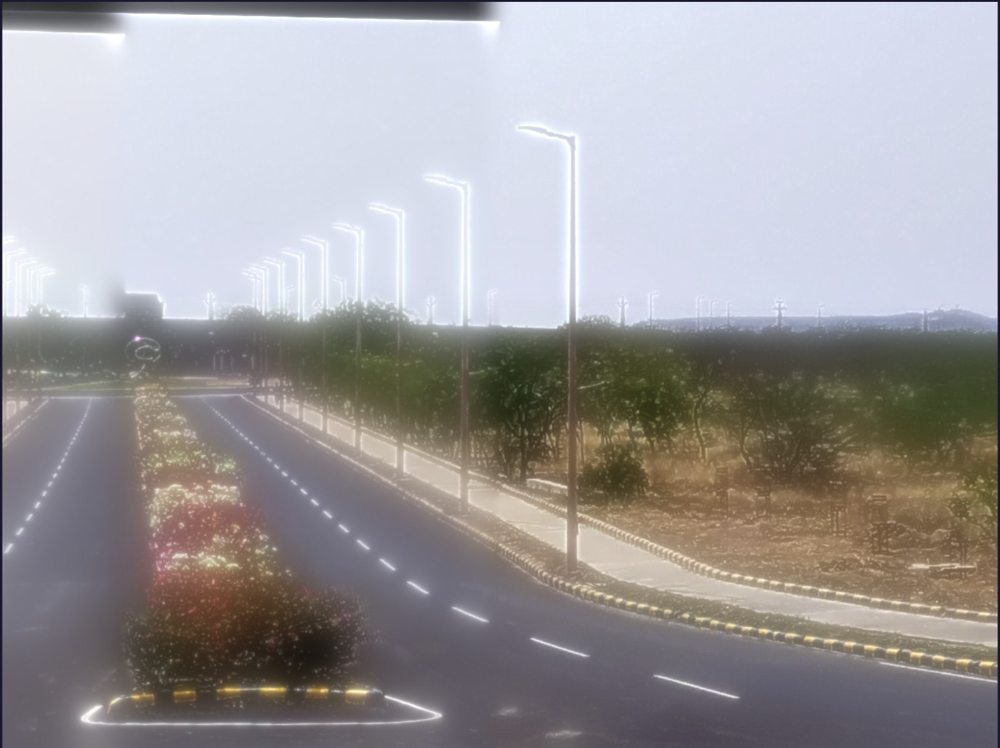
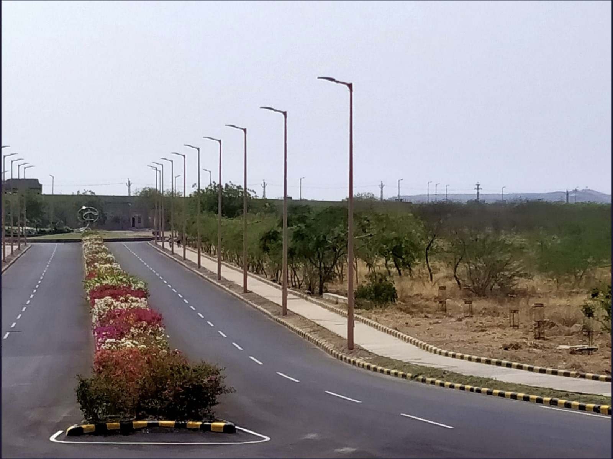
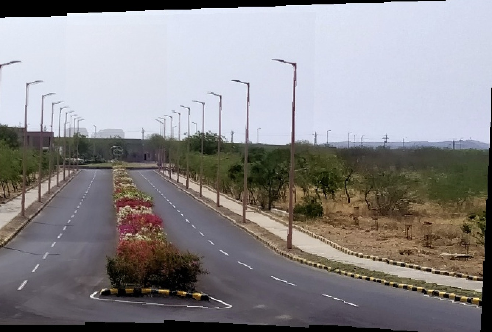
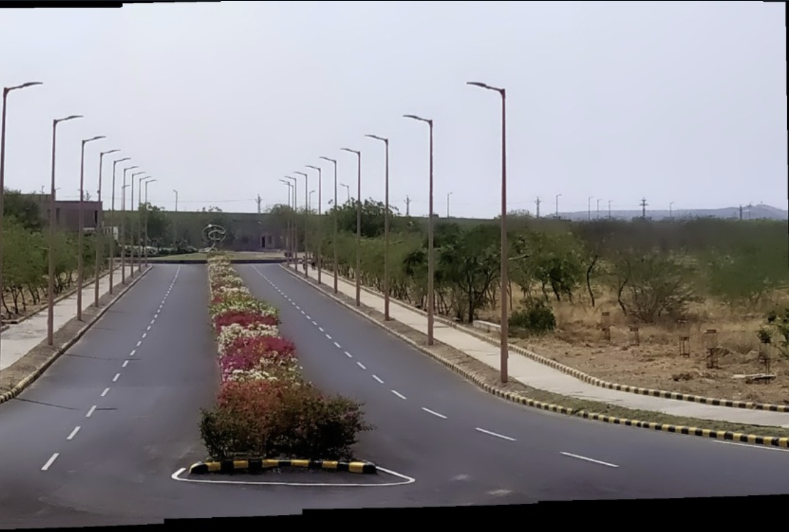

# Feature-based Image Stitching Benchmark~ FISB
___
[Report](./B20CS002_B20CS003_FISB_Report.pdf) | [Demo-video](https://youtu.be/hbBockxgOn4) | [Dataset](./fisb_dataset/) | [Presentation](FISB-ppt.pdf)

## Introduction
The repo presents feature-based image stitching algorithms for creating panoramic images from multiple input images. The proposed method involves feature extraction, matching, and blending stages. The Google Landmarks database and a custom dataset were used to evaluate the effectiveness of the proposed pipeline, which was measured using objective and subjective metrics, including accuracy, speed, and visual quality. The experimental results show that the proposed pipeline can effectively stitch images and produce seamless panoramas. The pipeline is scalable and can be used in various applications, such as surveillance, virtual reality, and cartography.
---
## Demo video
 [](https://youtu.be/hbBockxgOn4)
---
## Execution
### Installing requirements with conda
Run the following command in the master root:
```shell
conda install --file requirements.txt
```
### Custom Pipeline execution
The following command executes `main.py` for a custom analysis of algorithms.
#### Function Parameters:
- Select the Feature Matching Algorithm
- Choose the Feature matching algorithm
- Specify the Image Blending tecnhique in `main.py` for the usecase
- `n`: number of images, `alpha`: maximum feature descriptors (1<=`alpha`<=100)

```shell
python main.py
```
### Automated FISB Pipeline Execution
Executing autoMain.py instead of main.py:
```py
python FISB-Pipeline/autoMain.py {Feature Descriptor} {Matching Algorithm} {n} {alpha} fisb_dataset/sub/{}/ >> output/logs/log{}.txt
```
### Executing script for the fisb dataset
```shell
python script.py
```
---
### Dataset description
* Find dataset [here](./fisb_dataset/)
* Dataset has two folders: `sub` and `super`
* `super` has 49 natural and digital scenes
* `sub` has 49 folders containing sub-images of the scenes in `super`
* the sub-images are of varrying view-points, perspective, device, camera orientation and illumination


##### Note: Results of our implementation from using SIFT+BFMatcher+Seamless blending (best result parameters) have been cached [here](./SIFT_BFM_Seamless/)


`scene_9.png`

`sub-images of scene 9`

---
## Comparisons

Lets compare different blending results on `scene_10`

##### Original Image

##### Sub Images of Scene 10

* Some blending techniques employ different masking techniques. To compare on equal footing, the final stitched image is cropped and presented as below


##### Alpha Blending

##### Gaussian Blending

##### Multiband Blending

##### Seamless blending

##### Result given by OpenCV

* For more comprehensive analysis and comparison, refer to [report]()

---

### Contributors
> Abhishek Rajora rajora.1@iitj.ac.in ;  Github: [brillard1](https://github.com/brillard1)

> Abu Shahid shahid.3@iitj.ac.in ; Github: [ceyxasm](https://github.com/ceyxasm)
